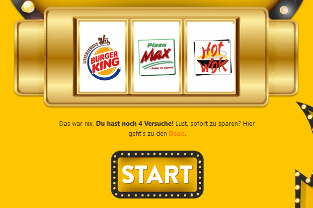
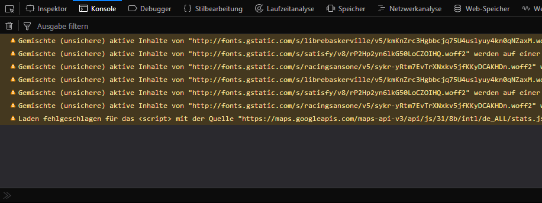
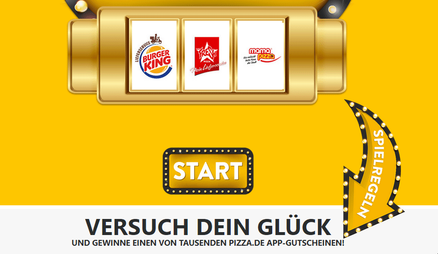

import { getImage, GatsbyImage } from 'gatsby-plugin-image';

> „Never trust user input“

Diese einfache Regel der Web-Sicherheit sollte jeder Web-Entwickler schon mal gehört haben, doch trotzdem gibt es noch immer viele Entwickler, die sich nicht genug darum kümmern und genau das wird vielen Seiten zum Verhängnis.

## Das Casino

Als ich mir vor kurzem Sushi auf [Pizza.de](https://web.archive.org/web/20180303184257/https://pizza.de/) (Ja, ich sehe den Wiederspruch) bestellt habe wurde mir auf der Bestellbestätigungs-Seite Werbung für das so genannte [Pizza.de-Casino](https://web.archive.org/web/20180306155955/https://pizza.de/casino/) angezeigt. Da ich eh auf meine Bestellung warten musste und man nichts beahlen muss dachte ich mir, dass man das ja mal probieren kann.

Nach 9 von 10 täglichen Versuchen war ich schließlich frustriert: „Es muss doch irgend einen anderen Weg geben…“ Also habe ich mir die Netzwerkaktivität wärend des Spielens angesehen: Eine Anfrage an Facebook und eine an Google, beides Analytics. Folglich muss mein eigener Browser berechnen, ob ich gewonnen habe oder nicht.

## Der Code

Nachdem ich das sah war die Challenge nicht mehr zu ignorieren: ICH WILL GEWINNEN!

Also habe ich mich durch den Code gewühlt und mir fielen mehrere Variablen auf, die offensichtlich für die Gewinnchancen zuständig sind. (Fun Fact: Die Chance beim ersten Versuch ist größer als bei allen weiteren) Als ich aber mit denen ein bisschen ohne Ergebnis rumgespielt habe, habe ich mich direkt in die Funktionen gesetzt und nachvollzogen was das Programm genau macht wenn ich den Button drücke, und da war es: In Zeile 203

fand sich die Funktion „win“…

    <GatsbyImage alt='win();' image={getImage(props.localImages[0])} />

Aber das kann doch nicht funktionieren… Die Web-Sicherheit…

## Der Test

Also nichts wie ab damit in die Konsole und…

    
    

…gewonnen, der Code war besiegt, die Challenge gemeistert, die Web-Sicherheit im A**** und ich zufrieden. Toll. Aber was nun? Sich ganz viele Gutscheine auf Prepaid-Nummern holen? Zu anstrengend. Pizza.de Bescheid sagen? Ja, aber nicht genug… Darüber schreiben und eine Moral für jeden Entwickler draus ziehen? Ja, das klingt gut!

## Die Moral von der Geschicht‘...

**...User-Input trauen tut man nicht.** Selbst große Firmen mit gut bezahlten Entwicklern machen diesen Fehler: Die Performance der Seite wird auf Kosten der Sicherheit verbessert und dem Browser des Benutzers wird blind vertraut. Doch wie kann man so etwas lösen?

Das Casino sollte im Hintergrund seine Ergebnisse auf dem Server generieren, auch wenn es eine kurze Ladezeit gäbe und vom Server einen Token bekommen, mit dem der Gewinn abgeholt werden könnte. Somit würde der Server entscheiden ob ein Gutschein herausgegeben wird und nicht ein hobbyloser Typ mit einem PC.

<small>Importiert aus altem Blog - <a href="https://web.archive.org/web/20201216152631/https://blog.1in9.net/2018/03/never-trust-user-input-gratis-pizza/" target="_blank" rel="noreferrer  ">Archiviertes Original</a></small>
